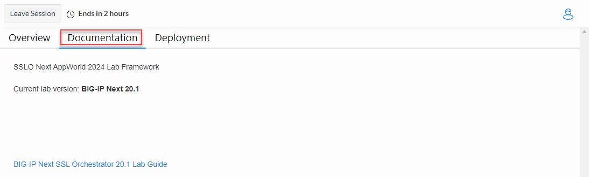

.. role:: red
.. role:: bred

Accessing the Virtual Lab
================================================================================

If you are not familiar with the process for joining a training course, refer to:

- |join_link|
- |interface_link|

You should have received a course registration email that contains the UDF course link. Click on the link and log into the UDF student portal.

After joining the course, you will see the **DOCUMENTATION** tab with some information about the lab resources and a link to the Lab Guide (this document).

.. note::

   You will use only your local web browser to perform the lab exercises.

#. Click on the **DEPLOYMENT** tab to see all of your lab resources. You will only need to access the **BIG-IP-Next-CM**
   instance with a web browser and the **Ubuntu-Client** machine using the web-based RDP client (Guacamole) that is hosted on the **Ubuntu-Server** machine.

   .. image:: ./images/udf-deployment.png
      :align: left

.. |join_link| raw:: html

      <a href="https://help.udf.f5.com/en/articles/3832165-how-to-join-a-training-course" target="_blank"> How to join a training course </a>

.. |interface_link| raw:: html

      <a href="https://help.udf.f5.com/en/articles/3832340-training-course-interface" target="_blank"> How to use the training course interface </a>

