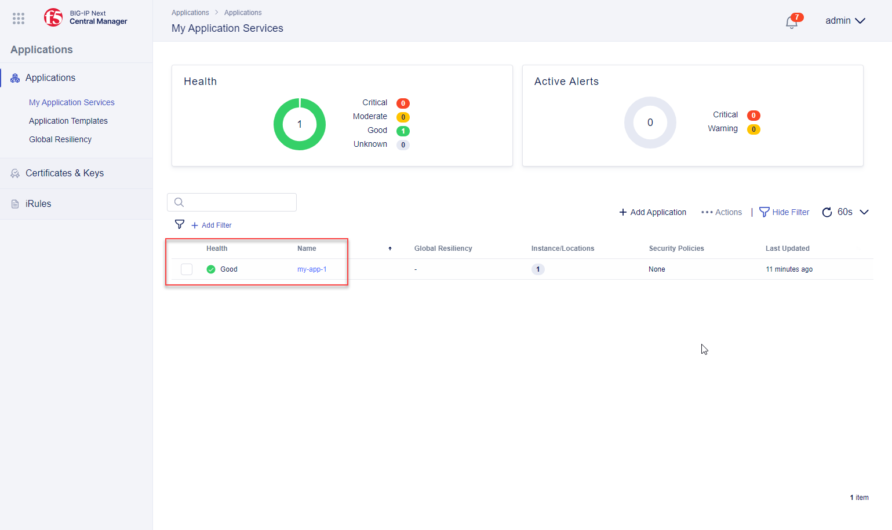

Deploying an Application
==============================================================================

TLS Certificates and Keys
--------------------------------------------------------------------------------

.. note::
   The **wildcard.f5labs.com** certificate and key has been pre-loaded into the BIG-IP CM, so you will not need to import any certificates at this time.

#. In the top left corner of the BIG-IP Central Manager GUI, click on the **Workspace** icon (it looks like a waffle pattern) to show the **Workspace Menu**.

   .. image:: ./images/workspace-menu-1.png

#. Click on **Applications** to navigate to the Applications workspace.

   .. image:: ./images/workspace-menu-2.png

#. Click on **Certificates & Keys** in the left menu.

   .. image:: ./images/certs.png

#. Click on **wildcard.f5labs.com** to view the certificate properties panel.

#. Click on the **Cancel & Exit** button to close the panel.

Create an HTTPS Application
--------------------------------------------------------------------------------

Now, you will create a simple HTTPS application.

#. In the **Applications** menu, click on **My Application Services**.

#. Click on the **Start Adding Apps** button to open the **Add Application** panel.

#. Enter ``my-app-1`` in the **Application Service Name** field.

#. Leave the **Application Service** type selection as **Standard** (default).

   .. image:: ./images/add-app-1.png

#. Click on the **Start Creating** button to open the **Application Service Properties** panel.

#. Enter ``My first application`` in the **Description** field.

#. Click on the **Start Creating** button to reveal the **Virtual Server** and **Pool** configuration options.

   .. image:: ./images/add-app-1b.png

#. Click on **Pools** to show the Pool configuration options.

   .. image:: ./images/add-app-2.png

#. Click on **+ Create** to add a new Pool.

   - Enter ``my-pool`` in the **Pool Name** field.
   - Change the **Service Port** to ``443`` (default value was **80**)
   - Click on the **Monitor Type** field to show the available options.
   - De-select **http** and select **icmp**
   - Click outside of the list to use the selected options.

   .. image:: ./images/add-app-3.png

#. Click on **Virtual Servers** to switch to back to the Virtual Server configuration options.

   - Enter ``my-app`` in the **Virtual Server Name** field.
   - In the **Pool** field, select the **my-pool** pool.
   - Change the **Virtual Port** to ``443`` (default value was **80**)

#. In the **Protocols & Profiles** field, click on |edit-icon| (**edit icon**) to open the settings panel.

   .. |edit-icon| image:: ./images/edit-icon.png

   .. image:: ./images/add-app-4.png

#. Enable (toggle on) the **Enable HTTPS (Client-Side TLS)** option to show additional settings.

   - Click on the **Add** button to open the configuration panel.
   - In the **Add Client-Side TLS** panel, enter ``wildcard.f5labs.com`` as the name
   - Select **wildcard.f5labs.com** in the **RSA certificate** dropdown list box. This certificate was pre-installed in your lab environment.
   - Click on the **Save** button to close the panel.

   .. image:: ./images/add-app-5.png

#. Scroll down to see the other **Protocol & Profiles** options.

#. Enable (toggle on) the **Enable Server-side TLS** option.

#. Ensure that the **Enable SNAT** and **Enable Auto SNAT** options are enabled (default).

#. Disable (toggle off) the **Enable Connection Mirroring** option.

   .. image:: ./images/add-app-6.png

#. Click on the **Save** button to the close the **Protocols & Profiles** panel. 

   Notice that the **TLS** and **HTTPS** badges were added, and **MIRRORING** was removed.

   .. image:: ./images/add-app-7.png

#. At the bottom right corner, click on the **Review & Deploy** button to open the **Deploy** panel.

   - Click on the **Start Adding** button.
   - Select the instance named **bigip-next.f5labs.com**.
   - Click on the **+ Add to List** button to see the additional deployment settings.

   .. image:: ./images/add-app-7b.png

#. In the **Virtual Address** field, enter ``10.1.10.20`` .

   .. image:: ./images/add-app-8.png

#. You will see **0** in the **Members** column, click on the down arrow and then click **+ Pool Members** to define Pool Members.

   - Click on the **+ Add Row** button 3 times to create empty entries.

   - Add the following entries:

      - Name: ``mbr-192.168.100.11``, IP Address: ``192.168.100.11``
      - Name: ``mbr-192.168.100.12``, IP Address: ``192.168.100.12``
      - Name: ``mbr-192.168.100.13``, IP Address: ``192.168.100.13``

   - Click on the **Save** button to close the Pool settings panel.

   .. image:: ./images/add-app-9.png

#. Click on the **Validate All** button to validate the pending configuration changes.

   .. image:: ./images/add-app-10.png

#. If validation is successful, you will see **Validated** and a link to **View Results**. Click on the link to view the configuration (JSON format) in a new panel.

   .. image:: ./images/add-app-11.png

#. Click on the **Exit** button to close the panel.

#. Click on the **Deploy Changes** button. Then, click on the **Yes, Deploy** button to send the application configuration to the BIG-IP Next instance.

   .. image:: ./images/add-app-12.png

When the deployment has completed, the **Application Services** dashboard will show the status of the new application.

