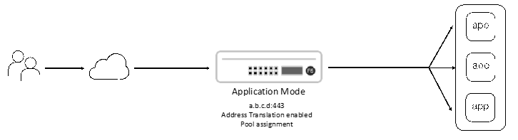

Inbound Application Mode
==============================================================================

The SSL Orchestrator **inbound application mode** deployment describes a
scenario where the client's destination address terminates on the F5
BIG-IP. Effectively, this is a simple extension of a standard BIG-IP
Next application deployment, where SSL Orchestrator policy and
inspection services are applied to an application workflow.

|

.. note::
   The following instructions assume basic connectivity to the lab environment, and administrative access to the lab network and virtual machine configurations. 
