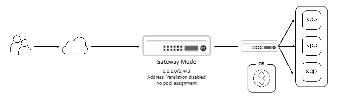

Define an Inbound Gateway Mode Deployment
==============================================================================

The SSL Orchestrator **inbound gateway mode** deployment describes a
scenario where the F5 BIG-IP functions in a routing mode. The
destination address is behind the BIG-IP and traffic is routed through
as a next hop. Effectively, this is a departure from the standard
application deployment with the following attributes:

-  The virtual server listens on a wildcard (0.0.0.0/0) IP subnet, and
   optionally a wildcard (any) port.

-  No pool is assigned to the virtual server.

-  No destination address translation (NAT) is performed, however SNAT
   can still be done.

Beyond this, the SSL Orchestrator policy and inspection services are
attached in exactly the same way as other application workflows.

The following instructions assume basic connectivity to the lab
environment, and administrative access to the lab's network and virtual
machine configurations.

TBD
--------------------------------------------------------------------------------

#. TBD

|

.. attention::
   This is the end of the lab module.
