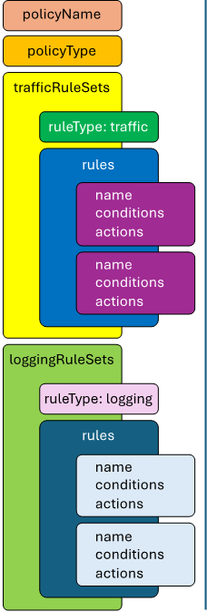
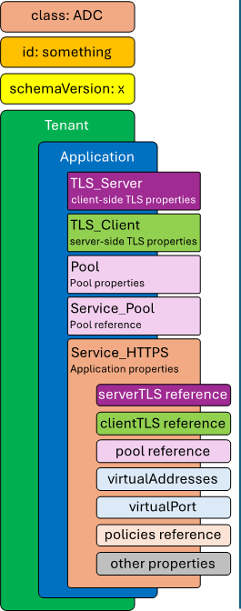

Creating a Deployment via API
================================================================================

Create an Inspection Service
--------------------------------------------------------------------------------

Creation of an SSL Orchestrator Inspection Service involves two steps:
- Create the Inspection Service definition
- Deploy it to a BIG-IP Next instance

#. In the **Create SSLO Deployment** folder, click on the **Create SSLO Inspection Service - TAP** request to select it.

   .. image:: ./images/api-tap-1.png

#. Click on the **Send** button to submit the request to the BIG-IP CM API. 

#. To create a TAP Inspection Service, send the following API call to BIG-IP CM (remember your **Authorization: Bearer** token):

   .. code-block:: text

      POST https://{{CM}}/api/v1/spaces/default/security/inspection-services
      {
         "name": "my-sslo-tap",
         "description": "My SSLO TAP Inspection Service",
         "type": "tap-vlan",
         "network": {
            "vlan": "sslo-insp-tap"
         }
      }

   Parameters:

   - **Type** defines either **tap-vlan** (default) or **tap-clone-pool**. The former minimally requires a specified **vlan**. The latter requires **vlan**, **destinationMacAddress**, and **endpoints/address values**. The **tap-vlan** option is the preferred TAP configuration, so we'll use this here.

   .. note::
      Online documentation for this TAP Inspection Service API can be found at:
      https://clouddocs.f5.com/products/big-iq/mgmt-api/v0.0.1/ApiReferences/bigip_public_api_ref/r_openapi-next.html#operation/CreateInspectionService

#. Once defined in BIG-IP CM, the Inspection Service must then be deployed to a BIG-IP Next instance. The above API call will return a JSON payload containing the **id** value of the new TAP Inspection Service object. Copy this value because it will be needed in the instance deploy API call, as well as the service chain creation API call. 

#. The instance deployment also requires knowledge of the BIG-IP Next instance **id**. To retrive that, send the **Get BIG-IP Instances** request from the **Collection**.

   To get that, make the following request:

   .. code-block:: text

      GET https://{{CM}}/api/v1/spaces/default/instances?select=hostname,id

#. The returned JSON payload will include a listing for each associated BIG-IP Next instance, by hostname and **id** value. Copy the BIG-IP Next instance **id** value for use in the next API call.

#. Deploy TAP Inspection Service to the BIG-IP Next instsance using the following API call:

   .. code-block:: text

      POST https://{{CM}}/api/v1/spaces/default/security/inspection-services/{{insp-tap-id}}/deployment
      {
         "deploy-instances": [
            "8739f022-3bbf-4796-ac3d-a7e3ac539788"
         ],
         "undeploy-instances": []
      }

   Variables:

   - ``{{insp-tap-id}}``: The **id** value of the created TAP Inspection Service from the TAP creation request. The value inside the **deploy-instances** array is the **id** value of the BIG-IP Next instance. This would be a comma-delimited array if deploying to multiple instances.

   .. note::
      This same API call is used for deploying and un-deploying inspection services from BIG-IP Next instances. While not expressly required for automation practices, it is useful at this point in the lab to open up the CM UI again, navigate to the Inspection Services page under SSL Orchestrator in the Security workspace, and view the freshly created (and deployed) TAP Inspection Service.

   Next, you will add this inspection service to a service chain.

Create a Service Chain
--------------------------------------------------------------------------------

With one or more inspection services created, it's now time to create a service chain that will define an ordered set of these for use in a security policy. Service chain creation minimally requires the **name** of the service chain and the **id** value of each inspection service in an array block. You would have captured this **id** value in the initial inspection service creation step above.

#. Create an SSLO Service Chain using the following API call:

   .. code-block:: text

      POST https://{{CM}}/api/v1/spaces/default/security/service-chains
      {
         "name": "my-api-service-chain",
         "inspection_services": [
            "84405fab-aa2d-41bd-81eb-9b176b84a699"
         ]
      }

#. If you didn't get a chance to copy the **id** value of the Inspection Service earlier, or want to add additional inspection services to this service chain, the Inspection Services and their respective **id** values can be obtained with the following API call:

   .. code-block:: text

      GET https://{{CM}}/api/v1/spaces/default/security/inspection-services?select=name,id

   The services in the service chain are ordered as they appear in this array.

Create a Traffic Policy
--------------------------------------------------------------------------------

You will now create an SSL Orchestrator security policy. This is the set of traffic condition rules that will control TLS decryption and bypass decisions, and dynamic service chaining to the Inspection Services. 

A policy is constructed based on the following schema:

The SSL Orchestrator policy is naturally more complex than other SSL Orchestrator objects, purely for its immense flexibility, so we will start with a simpler representation of a policy and then describe each part.

#. Create a Security Policy for an inbound application using the following API call:

   .. code-block:: text

      POST https://{{CM}}/api/v1/spaces/default/security/policies
      {
      "policyName": "my-api-policy",
      "policyType": "default",
      "trafficRuleSets": [
         {
            "ruleType": "traffic",
            "rules": [
            {
               "name": "rule1",
               "conditions": [
                  {
                  "conditionType": "SSL_EXTENSION_SERVERNAME",
                  "operator": "equals",
                  "values": [
                     "test.f5labs.com"
                  ]
                  }
               ],
               "actions": [
                  {
                  "actionType": "SSL_PROXY_BYPASS"
                  },
                  {
                  "actionType": "SERVICE_CHAIN",
                  "serviceChain": "7ca04aed-486b-4fd5-9e63-dafa5819a671"
                  }
               ]
            },
            {
               "name": "All Traffic",
               "conditions": [],
               "actions": [
                  {
                  "actionType": "SSL_PROXY_INTERCEPT"
                  },
                  {
                  "actionType": "SERVICE_CHAIN",
                  "serviceChain": "7ca04aed-486b-4fd5-9e63-dafa5819a671"
                  }
               ]
            }
            ]
         }
      ],
      "loggingRuleSets": [
         {
            "ruleType": "logging",
            "rules": [
            {
               "name": "all-logging",
               "conditions": [
                  {
                  "conditionType": "L4_PORT",
                  "operator": "equals",
                  "values": [
                     443
                  ],
                  "local": true
                  }
               ],
               "actions": [
                  {
                  "actionType": "COLLECT_DATA"
                  }
               ]
            }
            ]
         }
      ]
      }

The above includes both the traffic rule set and a logging rule set.

Configuration:

- **policyName** is the arbitrary name of this SSL Orchestrator security policy.

- **policyType** is one of ``default`` (for inbound application mode) or ``inbound-gateway``.

- **trafficRuleSets** is an array that includes two objects: the ruleType string value and a rules array. The **ruleType** for trafficRuleSets is always ``traffic``.

- The **rules** array will contain one or more rules. Each rule inside this array includes a **name**, an array of **conditions**, and an array of **actions**. More to come on these below.

- Similarly, **loggingRuleSets** is an array for logging rules. Its corresponding **ruleType** is always ``logging``. The rules inside the rules array are specific to logging, so while the conditions can be similar to trafficRuleSets conditions, the actions will always be ``COLLECT_DATA``.

**Traffic and Logging Rules**

Inside each rule in a **rules** array, the condition array can contain one or more blocks of traffic **conditions**. If there is more than one traffic condition, these are logically additive (i.e., a logical AND operation). A single traffic condition block will contain the following values:

- **conditionType**: a string value representing a specific traffic condition.
- **operator**: the comparison operator (ex. equals, matches, etc.)
- **values**: the value to match the conditionType against
- **local**: when used with some conditions, determines a client-side perspective (``false``) or server-side perspective (``true``).

Along with each array of one or more traffic conditions inside a rule, the **actions** array defines what actions are to be performed if this rule matches the traffic. A single action block will contain the following value(s):

- **actionType**: defines the action to take on a matching flow and could be one of the following (as of 20.2) ``RESET``, ``SERVICE_CHAIN``, ``SSL_PROXY_BYPASS``, or `SSL_PROXY_INTERCEPT`. If the actionType is ``SERVICE_CHAIN``, an additional **serviceChain** value is required specifying the **id** value of the service chain.

Please note the following *rules* for creating SSL Orchestrator policies via API:

- As previously mentioned, if multiple **conditions** are included in the conditions array of a single rule, these are additive (i.e., a logical AND operation). Similarly, if multiple actions are included in the actions array of a single rule, these too are additive (i.e., do this, and this, and this, etc.).

- Whereas CM defines an **All Traffic** condition for all traffic rule sets to be applied if no other traffic conditions match, the API definition does not explicitly require this. It is, however, highly recommended to include an **All Traffic** condition at the end of every trafficRuleSets, rules array. The **conditions** should be empty, and **actions** can include multiple action blocks. For example:

   .. code-block:: text

      {
         "name": "All Traffic",
         "conditions": [],
         "actions": [
            {
               "actionType": "SSL_PROXY_INTERCEPT"
            },
            {
               "actionType": "SERVICE_CHAIN",
               "serviceChain": "7ca04aed-486b-4fd5-9e63-dafa5819a671"
            }
         ]
      }

Create an Application with an SSL Orchestrator Policy
--------------------------------------------------------------------------------

The last API step is to apply the security policy to an application. However, now you will using the CM API (instead of the GUI) to create a new HTTPS application. The following represents the most basic form of application API declaration, including association with the SSL Orchestrator traffic policy. Note that the following API call creates the application in BIG-IP CM. A subsequent request is needed to deploy that application to a BIG-IP Next instance.

Note here that BIG-IP automation will generally define a set of endpoints:

- Security: /api/v1/spaces/default/security/ - that includes the set of interfaces for creating SSL Orchestrator objects.
- AS3 (F5 BIG-IP Application Services 3 Extension): /api/v1/spaces/default/appsvcs - that includes the set of interfaces for creating BIG-IP application objects.
- FAST (F5 BIG-IP Application Services Templates): /api/v1/spaces/default/appsvcs/blueprints - that includes the set of interfaces for creating templates and applications from templates using the FAST API.

In this lab, we will focus on the first two (security and AS3) API endpoints. The following application definition uses the F5 BIG-IP Central Manager AS3 endpoint.

#. Create SSL Orchestrator Application

   .. code-block:: text

      POST https:// {{CM}}/api/v1/spaces/default/appsvcs/documents
      {
      "class": "ADC",
      "id": "adc-canonical",
      "schemaVersion": "3.43.0",
      "my_tenant": {
         "class": "Tenant",
         "my_app": {
            "class": "Application",
            "my_server_tls": {
            "class": "TLS_Server",
            "certificates": [
               {
                  "certificate": "webcert"
               }
            ],
            "ciphers": "DEFAULT",
            "tls1_1Enabled": true,
            "tls1_2Enabled": true,
            "tls1_3Enabled": false
            },
            "my_client_tls": {
            "class": "TLS_Client",
            "ciphers": "DEFAULT",
            "tls1_1Enabled": true,
            "tls1_2Enabled": true,
            "tls1_3Enabled": false
            },
            "my_pool": {
            "class": "Pool",
            "loadBalancingMode": "round-robin",
            "members": [
               {
                  "serverAddresses": [
                  "192.168.100.11",
                  "192.168.100.12",
                  "192.168.100.13"
                  ],
                  "servicePort": 443
               }
            ],
            "monitors": [
               "https"
            ]
            },
            "my_pool_service": {
            "class": "Service_Pool",
            "pool": "my_pool"
            },
            "my_service": {
            "class": "Service_HTTPS",
               "allowNetworks": [
               {
                  "bigip": "Default L3-Network"
               }
            ],
            "persistenceMethods": [],
            "policySslOrchestrator": {
               "cm": "my-api-policy"
            },
            "clientTLS": "my_client_tls",
            "pool": "my_pool",
            "serverTLS": "my_server_tls",
            "snat": "auto",
            "virtualAddresses": [
               "10.1.10.22"
            ],
            "virtualPort": 443
            },
            "webcert": {
            "class": "Certificate",
            "certificate": {
               "cm": "wildcard.f5labs.com.crt"
            },
            "privateKey": {
               "cm": "wildcard.f5labs.com.pem"
            }
            }
         }
      }
      }

Let us now walk through some of the parts of this request to get a better understanding of the mechanism.

An Application is constructed based on the following schema:

**class** is always ``ADC`` here.

**id** is an arbitrary value.

**schemaVersion** defines the specific schema version to use.

**Tenant** (``class: Tenant``) defines the highest class in a declaration, which becomes a partition on the BIG-IP. Each tenant comprises a set of Applications that belong to one authority (system role).

**Application** (``class: Application``) comprises the set of resources used to manage, secure, and enhance the delivery of a simple or complex network-based application. Inside each Application will typically be the following set of objects:

**TLS_Server** (``class: TLS_Server``) defines the client-side TLS properties for the application and would minimally include a list of certificates, a cipher string, and TLS versions to enable.

**TLS_Client** (``class: TLS_Client``) defines the server-side TLS properties for the application and would minimally include a cipher string and TLS versions to enable.

**Pool and Service_Pool** (``class: Pool`` and ``class: Service_Pool``) defines the server-side endpoints to pass traffic to. The Pool class will contain the list of pool members, a load balancing mode, service (destination) port, and a health monitor.

**Service_HTTPS** (``class: Service_HTTPS``) defines the properties of an HTTPS-type application, and will minimally include references to the other defined objects (TLS_Server, TLS_Client, Pool), a list of listening IP addresses and destination port, and other required properties (ex. persistence method, SNAT, etc.). This is also where a reference to the SSL Orchestrator policy object is defined.

The individual blocks in the AS3 declaration may also reference other objects in the following manner:

- **Direct internal reference** - where an object references another object within the same declaration. Using the above example, the **clientTLS** property inside the **Service_HTTPS** class references the **TLS_Client** class.

- **BIG-IP instance reference** (``bigip``) - where the declaration references an object already deployed on a target BIG-IP Next instance. Using the above example, the **allowNetworks** object in the **Service_HTTPS** class references the **Default L3-Network** that exists on the target BIG-IP. Note that in a strict *fleet management* perspective, where objects are only deployed to a BIG-IP when associated with a deployed application, the ``bigip`` reference is not used often. This will typically be used to target existing (onboarded) networks.

- **Central Manager references** (``cm``) - where the declaration references an object defined at the CM. Using the above example, the **Certificate class** references the ``wildcard.f5labs.com`` certificate and key imported to BIG-IP CM. Likewise, the **policySslOrchestrator** object inside the **Service_HTTPS** class references the ``my-sslo-policy`` SSL Orchestrator policy that only exists on the BIG-IP CM. When the application is deployed, all ``cm`` referenced objects will also be deployed to the target BIG-IP Next instance.

#. The request to create the AS3 application will return a JSON payload. Record the **application id** produced in that JSON response, as this will be needed for your next API request.

#.  You will now deploy the Application to the BIG-IP Next instance. Send the following API call using the **Thunder Client**:

   .. code-block:: text

      https://{{CM}}/api/v1/spaces/default/appsvcs/documents/{{app_id}}/deployments
      {
         "target": "{{Next}}"
      }

The ``{{app_id}}`` value is the JSON id returned from the application creation. The ``{{Next}}`` value is the IP address of the target BIG-IP Next instance.
