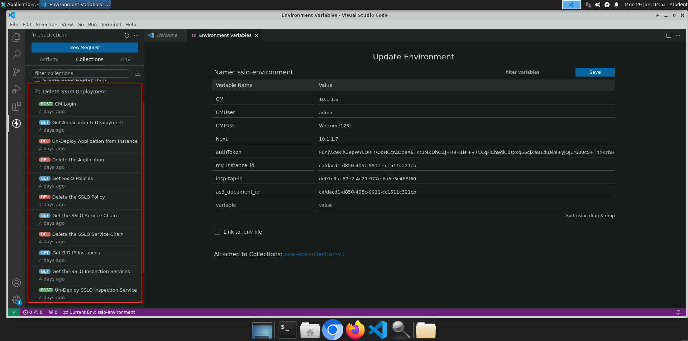

Deleting Configuration via API
================================================================================

Delete the Application, Policy, Service Chain, and Inspection Service
--------------------------------------------------------------------------------

You will now use the API to remove the configuration that you created.
As a general rule, objects must be deleted in order of their dependencies. 

The following order of operations is prescribed below:

- Un-deploy the application from the BIG-IP Next instances
- Delete the application
- Delete the SSL Orchestrator policy
- Delete the SSL Orchestrator service chain
- Un-deploy the inspection services from the BIG-IP Next instances
- Delete the inspection services

API requests matching the above tasks are saved in the **Delete SSLO Deployment** Collections folder.

#. **Send** each API request in the order listed to remove the previously deployed SSL Orchestrator deployment.

|

.. attention::
   This is the end of the lab module.
