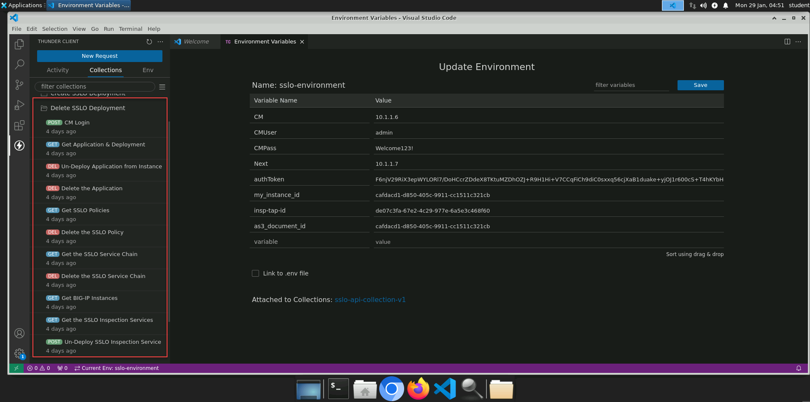

Deleting Configuration via API
================================================================================

Delete the Application, Policy, Service Chain, and Inspection Service
--------------------------------------------------------------------------------

You will now use the API to remove the configuration that you created.
As a general rule, objects must be deleted in order of their dependencies. 

The following order of operations is prescribed below:

- CM Login
- **GET** Application Service & Deployment IDs (multiple items in response)
- Un-deploy the Application Service from the BIG-IP Next instance
- Delete the Application Service
- **GET** SSLO Policy IDs (multiple items in response)
- Delete the SSL Orchestrator policy
- **GET** SSLO Service Chain IDs (multiple items in response)
- Delete the SSL Orchestrator Service Chain
- Get BIG-IP Instance ID
- **GET** SSLO Inspection Service IDs (multiple items in response)
- Un-deploy the Inspection Service from the BIG-IP Next instances
- Delete the Inspection Service

API requests matching the above tasks are saved in the **Delete SSLO Deployment** Collections folder.

#. **Send** each API request in the order listed to remove the previously deployed SSL Orchestrator deployment.

  .. note::
     The *test scripts* populate variables using the object **id** retrieved from the first element (index 0) in the responses to the **GET** API requests. The objects created via the API might not appear as the first element in the responses. In that case, you need to modify the *test scripts* to pick the correct object **id** based on the position in the response.

|

.. attention::
   This is the end of the lab module.
