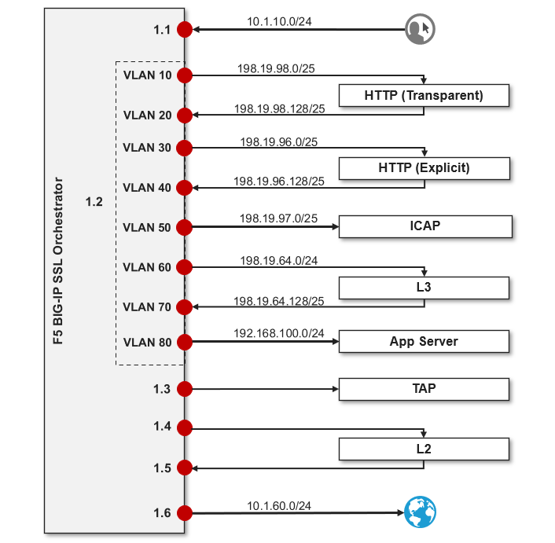

Lab Environment Details
================================================================================

.. note::

   This lab guide and corresponding UDF lab blueprint are prepared for **BIG-IP SSL Orchestrator** using a consolidated services lab architecture. All security services are consolidated into a single Ubuntu server instance using a Docker Compose environment.

|

Network Diagram
--------------------------------------------------------------------------------

Here is a visual representation of the virtual lab environment. The numbers inside the right edge of the SSL Orchestrator box indicate the port numbers and VLAN tags (if applicable). The colored boxes to the right of the services represent some product examples for each respective service type.

The first interface is connected to the client-facing VLAN. The last interface is connected to the Internet-facing VLAN. One of the tagged interfaces connects to the application server VLAN. The remaining interfaces are connected to various types of security services: L2, L3, HTTP, ICAP, and passive Tap. The SSL Orchestrator management interface is not shown.

Virtual Lab Infrastructure Details (and Credentials)
--------------------------------------------------------------------------------

The lab environment for this guide includes some prerequisite configuration settings that you
should be aware of. These are provided to simplify this course. If you wish to use
this lab guide with your own environment, please ensure that you create these objects in advance.

-  **Client side VLAN and subnet are pre-defined** - This is the VLAN
   that a client connects to for traffic flows. SSL Orchestrator does
   not define the client-side VLAN(s) and self-IP(s).

-  **Server side VLAN and subnet are pre-defined** - This is the VLAN
   that traffic egresses from the F5 BIG-IP to the web servers. SSL
   Orchestrator does not define the server-side VLAN(s) and self-IP(s).
   Consequently, the consolidated architecture will use the same
   interface on separate tagged VLANs to establish connectivity to the
   L3, HTTP, and ICAP inspection services.

-  **TAP service VLAN is pre-defined** - This is the VLAN that traffic egresses from
   the F5 BIG-IP to the TAP inspection service.

-  **CA certificate and private key are installed** - This is the CA
   certificate and private key that are used to re-issue (forge) remote
   server certificates to internal clients for outbound traffic flows.

-  **Server certificate and private key are installed** - For the
   inbound (reverse proxy) traffic flow use case, SSL traffic is
   terminated at the F5, and re-encrypted on the way to the internal
   application environment. A wildcard server certificate is installed
   to facilitate using any name under the "*f5labs.com*"
   sub-domain. 

   Individual server certificates are also included for the following applications: jsapp1.f5labs.com, jsapp2.f5labs.com, gwapp1.f5labs.com, gwapp2.f5labs.com, and gwapp3.f5labs.com.

|

.. note::

   It is a security best practice to isolate security
   devices within the protected network enclaves provided by SSL
   Orchestrator. Administrators will often desire NOT to move or change
   existing security services. However, while possible, passing this
   decrypted traffic to points on an existing network architecture could
   create multiple points of data exposure. Usernames, passwords, credit
   card numbers and other personally identifiable information (PII) could be exposed to
   other devices on that network. It is thus recommended that security
   devices exist in a "private enclave" local to the BIG-IP instance(s).
   Please keep this in mind when defining the network
   settings for the inspection services.*

|

The following tables provide device/service network configuration details. Login credentials are also provided for use as directed in the lab exercises.

**F5 BIG-IP SSL Orchestrator**

.. list-table:: 
   :header-rows: 1
   :widths: auto

   * - Username
     - Password
     - Description
   * - admin
     - admin
     - Admin account

|

.. list-table::
   :header-rows: 1
   :widths: auto

   * - Interface
     - IP
     - Description
   * - Management
     - 10.1.1.7/24
     - Management VLAN
   * - 1.1
     - 10.1.10.7/24
     - Client-Side VLAN (Ubuntu-Client)
   * - 1.2 (Tag 30)
     - 198.19.96.7/25
     - Inline HTTP service - Inbound
   * - 1.2 (Tag 40)
     - 198.19.96.245/25
     - Inline HTTP service - Outbound
   * - 1.2 (Tag 50)
     - 198.19.97.7/25
     - ICAP Service - Inbound/Outbound
   * - 1.2 (Tag 60)
     - 198.19.64.7/25
     - Inline L3 service - Inbound
   * - 1.2 (Tag 70)
     - 198.19.64.245/25
     - Inline L3 service - Outbound
   * - 1.2 (Tag 80)
     - 192.168.100.7/24
     - Server-side (lab webservers)
   * - 1.3
     - 198.19.97.7/25
     - TAP service - Inbound
   * - 1.4
     - N/A
     - Inline L2 service - Inbound
   * - 1.5
     - N/A
     - Inline L2 service - Outbound
   * - 1.6
     - 10.1.60.7/24
     - Internet

|

**Ubuntu-Client (inbound/outbound testing)**

.. list-table::
   :header-rows: 1
   :widths: 200 300 300

   * - Interfaces
     - IP Address
     - VLAN
   * - eth1
     - 10.1.10.50
     - Client-Side VLAN

|

.. list-table::
   :header-rows: 1
   :widths: auto

   * - Access
     - Username
     - Password
   * - WEB SHELL
     - N/A
     - N/A
   * - RDP / SUDO
     - ubuntu
     - agility

|

**Ubuntu-Server (consolidated services)**

.. list-table:: 
   :header-rows: 1
   :widths: 200 300 300

   * - Interfaces
     - IP Address
     - VLAN
   * - eth1
     - 10.1.20.50
     - Inline L3 services
   * - eth2
     - 10.1.30.50
     - TAP service
   * - eth3
     - 10.1.40.50
     - Inline L2 service - Inbound
   * - eth4
     - 10.1.50.50
     - Inline L2 service - Outbound

|

.. list-table::
   :header-rows: 1
   :widths: auto

   * - Access
     - Username
     - Password
   * - WEB SHELL
     - N/A
     - N/A
   * - WEBRDP (Guacamole)
     - user
     - user

The **WEBRDP** service leverages an instance of Guacamole running on the Ubuntu-Server. This acts as a web-based RDP client that connects to the Ubuntu-Client desktop GUI.

|

**Inline Layer 2 Service**

.. list-table::
   :header-rows: 0
   :widths: auto

   * - **Description**
     - Ubuntu server host  -- ens8 and ens9

       br0 (bridge) tied to ens8 and ens9 interfaces on host
   * - **Services**
     - Suricata

|

.. list-table::
   :header-rows: 1
   :widths: auto

   * - Traffic Flow
     - BIG-IP Interface
   * - Inbound
     - 1.4
   * - Outbound
     - 1.5

|

**Inline Layer 3 Service**

.. list-table::
   :header-rows: 0
   :widths: auto

   * - **Description**
     - Ubuntu server host -- ens6.60 and ens6.70
   * - **Services**
     - Firewall
   * - **Access**
     - $ ``docker exec -it layer3 /bin/bash``

|

.. list-table::
   :header-rows: 1
   :widths: auto

   * - Traffic Flow
     - BIG-IP Interface
     - Service IP Address
   * - Inbound
     - 1.2 tag 60
     - 198.19.64.30/25
   * - Outbound
     - 1.2 tag 70
     - 198.19.64.130/25

|

**HTTP Explicit Proxy Service**

.. list-table::
   :header-rows: 0
   :widths: auto

   * - **Description**
     - Ubuntu server host -- ens6.30 and ens6.40
   * - **Services**
     - Squid - Port 3128
   * - **Access**
     - $ ``docker exec -it explicit-proxy /bin/bash``

|

.. list-table::
   :header-rows: 1
   :widths: auto

   * - Traffic Flow
     - BIG-IP Interface
     - Service IP Address
   * - Inbound
     - 1.2 tag 30
     - 198.19.96.30/25
   * - Outbound
     - 1.2 tag 40
     - 198.19.96.130/25

|

**TAP Service**

.. list-table::
   :header-rows: 0
   :widths: auto

   * - **Description**
     - Ubuntu server host -- ens7

       ens7 interface tied to tap service on host
   * - **Services**
     - Passive TAP

|

.. list-table::
   :header-rows: 1
   :widths: auto

   * - Traffic Flow
     - BIG-IP Interface
     - MAC Address
   * - Bi-directional
     - 1.3
     - 12:12:12:12:12:12 (arbitrary if directly connected)

|

**ICAP Service**

.. list-table::
   :header-rows: 0
   :widths: auto

   * - **Description**
     - Ubuntu server host -- ens6.50
   * - **Services**
     - ICAP Clamav
   * - **Access**
     - $ ``docker exec -it icap /bin/bash``

|

.. list-table::
   :header-rows: 1
   :widths: auto

   * - Traffic Flow
     - BIG-IP Interface
     - Service IP Address
   * - Bi-directional
     - 1.2 (Tag 50)
     - 198.19.97.50
   * - Req/Resp URLs
     - /avscan
     - Port 1344

|

**Generic Web Server (3 instances)**

.. list-table::
   :header-rows: 0
   :widths: auto

   * - **Description**
     - Ubuntu server host -- ens6.80
   * - **Services**
     - Apache web server

       \*.f5labs.com
   * - **Access**
     - $ ``docker exec -it apache /bin/bash``

|

.. list-table::
   :header-rows: 1
   :widths: auto

   * - Traffic Flow
     - BIG-IP Interface
     - Service Access
   * - Bi-directional
     - 1.2 (Tag 80)
     - gwapp1.f5labs.com : 192.168.100.11 : Ports 80 & 443

       gwapp2.f5labs.com : 192.168.100.12 : Ports 80 & 443

       gwapp3.f5labs.com : 192.168.100.13 : Ports 80 & 443

|

**Juiceshop Vulnerable Application (2 instances)**

.. list-table::
   :header-rows: 0
   :widths: auto

   * - **Description**
     - Ubuntu server host -- ens6.80
   * - **Services**
     - NGINX app
   * - **Access**
     - $ ``docker exec -it nginx /bin/sh``

|

.. list-table::
   :header-rows: 1
   :widths: auto

   * - Traffic Flow
     - BIG-IP Interface
     - Service Access
   * - Bi-directional
     - 1.2 (Tag 80)
     - jsapp1.f5labs.com : 192.168.100.20 : Port 443

       jsapp2.f5labs.com : 192.168.100.21 : Port 443

|

.. warning::

   Simple passwords were used in this lab environment in order to make it easier for students to access the infrastructure. This does not follow recommended security practices of using strong passwords.

   This lab environment is only accessible via an authenticated student login.

