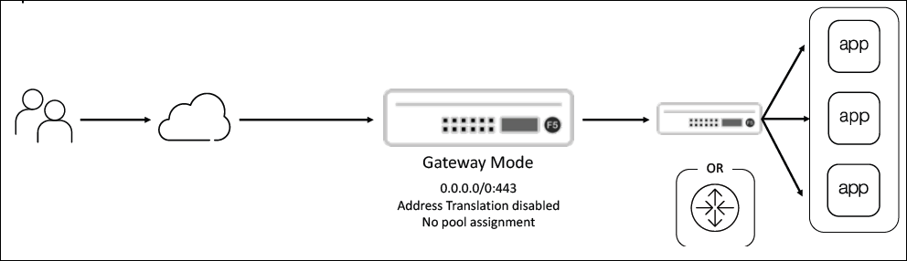

Inbound Gateway Scenario
================================================================================

Challenge
--------------------------------------------------------------------------------

In previous **inbound** SSL Orchestrator deployments, you used the **Existing Application** topology to attach SSL Orchestrator security policies and services to an existing application (LTM virtual server) that resided on the same BIG-IP instance. However, that method required you to add the SSL Orchestrator module to an existing BIG-IP that was already handling a lot of workloads. To avoid the risk of performance issues due to high resource utilization, your manager has asked for an alternative implementation that decouples SSL Orchestrator functionality from the LTM application delivery functionality.

|

Solution
--------------------------------------------------------------------------------

The **L3 Inbound - Gateway Mode** topology allows SSL Orchestrator to be implemented as a router in front of your existing BIG-IP ADC deployment. This architecture reduces resource utilization on the current ADC and allows it to be fully managed by a different team than the SSL Orchestrator (e.g., network/applications vs security roles). The SSL Orchestrator would still have the ability to apply different inspection services to each application based on security policy rules.

|

.. tip::

   This architecture also allows consolidation of SSL Orchestrator deployments to centrally protect many backend applications across different networks.
