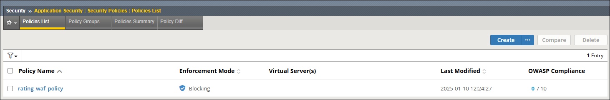

Pre-requisite Configuration
================================================================================

Before you can create the SSL Orchestrator topology for this module, you must meet some pre-requisites.

Create an F5 Advanced WAF Policy
--------------------------------------------------------------------------------

Since you will be using the on-box WAF module as an inspection service, you will need to create a WAF policy that can be selected during the SSL Orchestrator **Services** configuration step.

#. Let's first get logged into the BIG-IP UI. From the **Deployment** tab in the UDF console, select **ACCESS > TMUI** for the **BIG-IP SSL Orchestrator** resource (*Components > BIG-IP SSL Orchestrator > ACCESS > TMUI*). A new tab will open and present the BIG-IP login screen.

#. Log in as ``admin`` with password ``admin``.

   .. image:: images/tmui-login.png
      :align: left

#. In the left panel menu, click on on **Security** to see the available options.

#. Navigate to **Application Security > Security Policies** to view the Policies List.

#. Click on the **Create** button to see the policy configuration options.

#. Create a violation rating-based WAF policy:

   - Enter ``rating_waf_policy`` in the **Policy Name** field.

   - Click on the **Policy Template** drop-down menu and select **Rating Based Policy**.

   .. image:: images/waf-policy-create-1.png
      :align: left

   - Click on **OK** to accept the template change warning.

   - Notice that the **Enforcement Mode** is set to **Blocking**.

   .. image:: images/waf-policy-create-2.png
      :align: left

   - Click on the **Save** button at the top of the form and wait for the policy to be created.

You will see the Policy List as follows:

Configure the Pre-requisite Dependencies for SSL Orchestrator
--------------------------------------------------------------------------------

The base network configurations has been pre-configured on the BIG-IP. However, the settings for **NTP** and **Default Route** are missing.

#. In the left panel menu, click on **SSL Orchestrator** to see the available options.

#. Click on **Configuration** to initialize the **SSL Orchestrator Guided Configuration UI**.

#. Notice the **Required Configuration** section on the right side of the screen. There are some dependences that have not been met.

   .. image:: images/config-intro-1.png
      :align: left

#. To define the NTP server configuration:

   - Click on **Click to configure** beside **NTP** to edit the settings. A new browser tab will open.

   - Enter ``pool.ntp.org`` in the **Address** field.

   - Click on the **Add** button and then click on the **Update** button.

   .. image:: images/config-ntp.png
      :align: left

   - Close this browser tab to return to the SSL Orchestrator **Configuration** screen.

#. To define a default route for SSL Orchestrator access the Internet:

   - Click on **Click to configure** beside **Route** to edit the settings. A new browser tab will open.

   - Enter ``default`` in the **Name** field.

   - Enter ``0.0.0.0`` in the **Destination** field.

   - Enter ``0.0.0.0`` in the **Netmask** field.

   - Enter ``10.1.60.1`` in the **Gateway Address** field.

   .. image:: images/config-route.png
      :align: left

   - Click on the **Finished** button to save the new route.

   - Close this browser tab to return to the SSL Orchestrator **Configuration** screen.

You should now see that the NTP and Route configuration requirements are satisfied.

.. image:: images/config-intro-2.png
   :align: left
