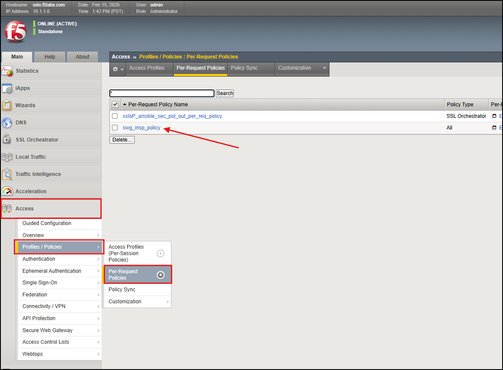
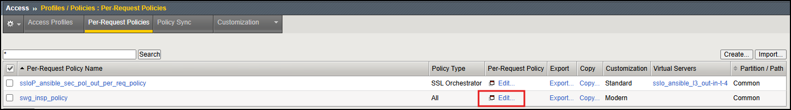
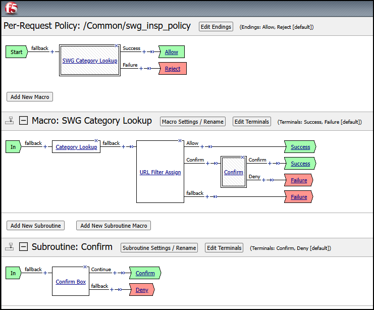

Automating a new SWGaaS Deployment
================================================================================

Within this lab, we will be deploying a new Secure Web Gateway as a Service (SWGaaS) deployment using Ansible Playbooks to automate the configuration on BIG-IP SSL Orchestrator. 

We will accomplishing the following:
 - Review Ansible playbooks needed for this deployment
 - Deploying a new SWG Service using Ansible Playbooks
 - Modifying the existing Service Chain to include the new SWG Service
 - Testing the new SWG Service

|

What is a Secure Web Gateway?
-----------------------------

Secure Web Gateway (SWG) is a forward-proxy security solution that provides protection against web-based threats by enforcing corporate and regulatory policies for internet access. It acts as a barrier between users and the internet, inspecting and filtering web traffic to prevent access to malicious websites, block inappropriate content. SWG can be deployed within BIG-IP SSL Orchestrator and is commonly used to enhance security and control over outbound web traffic.

Building a new SWG Service
-------------------------------------------------------------------------------

#. To build this new SWG, we will need to ensure there is a necessary prerequisite configuration in place. This should already be in place within the lab, however, lets make sure the component is in place.  

The BIG-IP SSLO SWGaaS Service relies on a pre-existing SWG Per-Request policy built in side the Access portion of BIG-IP. We will confirm it is in place and inspect the flow of the policy to understand how it works.  

#. Go to your BIG-IP SSL Orchestrator GUI a go to Access > Profiles / Policies > Per-Request Policies. You should see the ``swg_insp_polciy`` in place. This is the policy that the SWGaaS Service will rely on to trigger traffic to be sent to the SWGaaS service for inspection. 

.. note:: Please let an instructor know if the policy is not in place, as it is a necessary prerequisite for the SWGaaS Service to function properly.   

.. 
   comment:: If the policy is not in place, we can import it from the Ubuntu-Client VSCode instance.  The playbook is located at ``appworld_ansible_playbooks/BIG-IP_SWG_Profile/import_swg_policy.yaml``. You can run the playbook with the following command to import the necessary configuration: ``ansible-playbook -i notahost, appworld_ansible_playbooks/BIG-IP_SWG_Profile/import_swg_policy.yaml``. After running the playbook, refresh the GUI and you should see the policy in place.

#. Now we will review the policy flow the ``swg_insp_policy``. Click on the ``Edit`` link on to the right of the policy to open up the Visual Policy Editor.

#. Reviewing the Visual Policy Editor, we can see the flow of the policy. It enables the inspection of a Category Lookup to a pre-configured URL Filter. The URL filter can be modified to prevent access to various categories of websites. This policy uses the pre-built **default** filter.  
